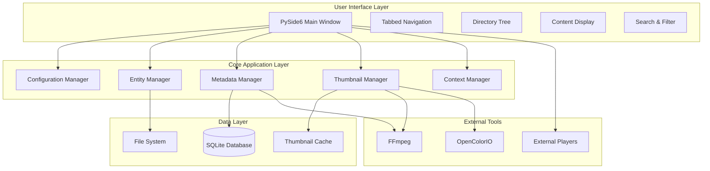
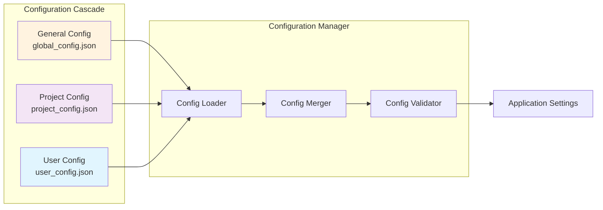
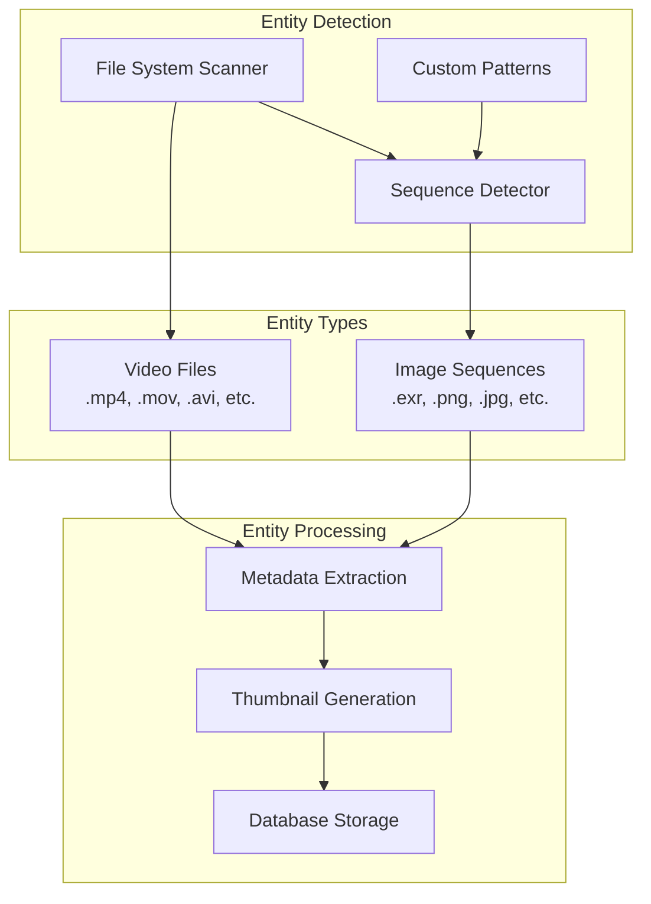

# Stockshot Browser - Architecture Overview

## System Architecture

Stockshot Browser is designed as a modular, cross-platform video file explorer with a focus on performance, flexibility, and industry-standard workflows.

### Technology Stack

- **Core Language**: Python 3.8+
- **GUI Framework**: PySide6 (Qt6)
- **Database**: SQLite for metadata storage
- **Video Processing**: FFmpeg for metadata extraction and thumbnail generation
- **Color Management**: OpenColorIO (OCIO)
- **Cross-Platform Support**: Linux, macOS, Windows

### High-Level Architecture



### Configuration System Architecture

The cascading configuration system provides maximum flexibility while maintaining clear precedence:



### Entity Management System



## Core Components

### 1. Configuration Manager
- **Purpose**: Handle cascading configuration system
- **Responsibilities**:
  - Load and merge configuration files in order
  - Validate configuration settings
  - Provide runtime configuration access
  - Handle configuration updates and persistence

### 2. Entity Manager
- **Purpose**: Manage video files and image sequences
- **Responsibilities**:
  - Scan file systems for media files
  - Detect and group image sequences
  - Apply custom sequence detection patterns
  - Maintain entity state and relationships

### 3. Metadata Manager
- **Purpose**: Extract, store, and manage media metadata
- **Responsibilities**:
  - Interface with FFmpeg for metadata extraction
  - Store metadata in SQLite database
  - Provide search and filtering capabilities
  - Handle custom metadata fields and tags

### 4. Thumbnail Manager
- **Purpose**: Generate and cache video thumbnails
- **Responsibilities**:
  - Generate thumbnails using FFmpeg
  - Apply color management with OCIO
  - Cache thumbnails in .thumbnails directory
  - Manage thumbnail resolution and quality

### 5. Context Manager
- **Purpose**: Handle project contexts and user profiles
- **Responsibilities**:
  - Manage project-specific settings and favorites
  - Handle user profiles and personal favorites
  - Isolate data between different production contexts
  - Provide context switching capabilities

## Database Schema

### Core Tables

```sql
-- Projects and contexts
CREATE TABLE projects (
    id INTEGER PRIMARY KEY,
    name TEXT UNIQUE NOT NULL,
    path TEXT NOT NULL,
    created_at TIMESTAMP DEFAULT CURRENT_TIMESTAMP,
    updated_at TIMESTAMP DEFAULT CURRENT_TIMESTAMP
);

-- Media entities (videos and sequences)
CREATE TABLE entities (
    id INTEGER PRIMARY KEY,
    path TEXT NOT NULL,
    type TEXT NOT NULL, -- 'video' or 'sequence'
    name TEXT NOT NULL,
    project_id INTEGER,
    created_at TIMESTAMP DEFAULT CURRENT_TIMESTAMP,
    updated_at TIMESTAMP DEFAULT CURRENT_TIMESTAMP,
    FOREIGN KEY (project_id) REFERENCES projects (id)
);

-- Metadata storage
CREATE TABLE metadata (
    id INTEGER PRIMARY KEY,
    entity_id INTEGER NOT NULL,
    duration REAL,
    fps REAL,
    width INTEGER,
    height INTEGER,
    colorspace TEXT,
    file_size INTEGER,
    format TEXT,
    codec TEXT,
    custom_fields TEXT, -- JSON blob for custom metadata
    FOREIGN KEY (entity_id) REFERENCES entities (id)
);

-- Tags system
CREATE TABLE tags (
    id INTEGER PRIMARY KEY,
    name TEXT UNIQUE NOT NULL,
    color TEXT
);

CREATE TABLE entity_tags (
    entity_id INTEGER,
    tag_id INTEGER,
    PRIMARY KEY (entity_id, tag_id),
    FOREIGN KEY (entity_id) REFERENCES entities (id),
    FOREIGN KEY (tag_id) REFERENCES tags (id)
);

-- Favorites system
CREATE TABLE favorites (
    id INTEGER PRIMARY KEY,
    entity_id INTEGER NOT NULL,
    project_id INTEGER, -- NULL for user favorites
    user_id TEXT, -- User identifier
    created_at TIMESTAMP DEFAULT CURRENT_TIMESTAMP,
    FOREIGN KEY (entity_id) REFERENCES entities (id),
    FOREIGN KEY (project_id) REFERENCES projects (id)
);

-- Thumbnails tracking
CREATE TABLE thumbnails (
    id INTEGER PRIMARY KEY,
    entity_id INTEGER NOT NULL,
    path TEXT NOT NULL,
    resolution INTEGER NOT NULL,
    created_at TIMESTAMP DEFAULT CURRENT_TIMESTAMP,
    FOREIGN KEY (entity_id) REFERENCES entities (id)
);
```

## Configuration File Structure

### General Configuration (global_config.json)
```json
{
    "version": "1.0.0",
    "paths": {
        "base_video_path": "/path/to/videos",
        "project_config_path": "/path/to/project/configs",
        "user_config_path": "/path/to/user/configs"
    },
    "thumbnails": {
        "default_resolution": 128,
        "cache_directory": ".thumbnails",
        "quality": 85
    },
    "ffmpeg": {
        "executable_path": "ffmpeg",
        "timeout": 30
    },
    "database": {
        "path": "video_explorer.db"
    }
}
```

### Project Configuration (project_config.json)
```json
{
    "project_name": "Project_Film_A",
    "paths": {
        "shared_storage": [
            "/shared/project_a/footage",
            "/shared/project_a/renders"
        ],
        "project_specific_paths": [
            "/project_a/dailies",
            "/project_a/finals"
        ]
    },
    "sequence_patterns": [
        "*.####.exr",
        "*_v###_*.jpg",
        "shot_*.%04d.png"
    ],
    "metadata": {
        "required_fields": ["copyright", "source"],
        "custom_tags": ["exterior", "interior", "vfx", "practical"]
    }
}
```

### User Configuration (user_config.json)
```json
{
    "user_id": "john_doe",
    "interface": {
        "theme": "dark",
        "default_view": "grid",
        "show_metadata_overlay": true,
        "open_tabs": [
            "/path/to/current/project",
            "/path/to/reference/footage"
        ]
    },
    "external_players": {
        "default": "/usr/bin/vlc",
        "alternatives": {
            "djv": "/usr/local/bin/djv_view",
            "rv": "/opt/rv/bin/rv"
        }
    },
    "thumbnails": {
        "cache_location": "/home/user/.video_explorer/thumbnails",
        "preferred_resolution": 256
    },
    "favorites": {
        "personal": [
            "/path/to/favorite/video1.mp4",
            "/path/to/favorite/sequence/"
        ]
    }
}
```

## Key Design Decisions

### 1. Modular Architecture
- Each major component is isolated and communicates through well-defined interfaces
- Enables easier testing, maintenance, and future extensions
- Supports plugin architecture for future enhancements

### 2. Cascading Configuration
- Provides flexibility for different deployment scenarios
- Allows project-specific overrides without affecting global settings
- User preferences always take precedence

### 3. Entity-Based Design
- Treats both videos and image sequences as first-class entities
- Unified metadata handling regardless of entity type
- Extensible for future media types

### 4. Caching Strategy
- Thumbnails cached locally for performance
- Metadata cached in SQLite for fast queries
- Configurable cache locations and sizes

### 5. External Tool Integration
- FFmpeg for all video processing tasks
- OpenColorIO for color management
- Configurable external players for maximum flexibility

## Performance Considerations

### 1. Lazy Loading
- Thumbnails generated on-demand
- Metadata extracted only when needed
- Directory contents loaded progressively

### 2. Background Processing
- Thumbnail generation in background threads
- Metadata extraction doesn't block UI
- Batch operations use worker threads

### 3. Caching Strategy
- Intelligent thumbnail caching
- Metadata caching in SQLite
- Configuration caching in memory

### 4. Database Optimization
- Indexed columns for fast searches
- Prepared statements for performance
- Connection pooling for concurrent access

This architecture provides a solid foundation for building a professional-grade video file explorer that meets the demanding requirements of industry workflows while maintaining flexibility and performance.